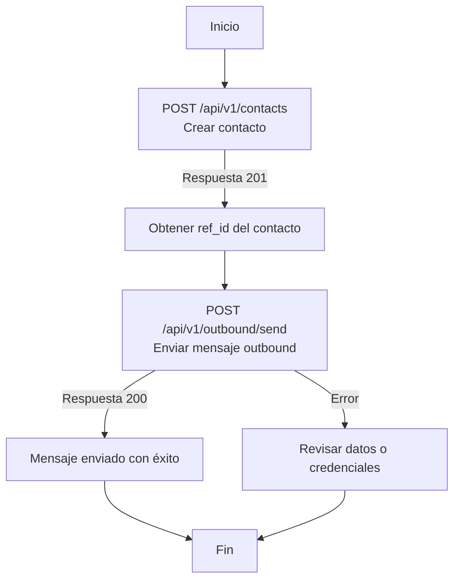

# **API de Contactos y Mensajería**

Esta API permite **crear contactos** y **enviar mensajes outbound** (por ejemplo, plantillas de WhatsApp) a través de integraciones configuradas.

---

## **Flujo General de Uso**
1. **Crear un contacto** → `POST /api/v1/contacts`  
   - Puedes enviar tu propio `ref_id` o dejar que el sistema lo genere automáticamente.
2. **Obtener el `ref_id`** del contacto creado.
3. **Enviar un mensaje outbound** → `POST /api/v1/outbound/send`  
   - Usando el `integration_id` de tu canal (ej. WhatsApp) y el `ref_id` como `contact_id`.

---

## **1. Crear Contacto**
**Endpoint:**  
```
POST https://engine.conversia.ai/api/v1/contacts
```

**Autenticación:**
- **Header obligatorio:**  
  `X-API-KEY: <tu_api_key>`
- **Unidad Organizacional (`org_unit_id`):**  
  - **Recomendado:** `X-API-ORGUNIT-ID: <uuid>` en el header  
  - **Alternativa:** `org_unit_id` en el body

**Headers requeridos:**
| Header | Tipo | Obligatorio | Descripción |
|--------|------|-------------|-------------|
| `X-API-KEY` | string | ✅ | Tu API Key |
| `X-API-ORGUNIT-ID` | uuid | ⚠️ | Obligatorio si no se envía en el body |
| `Content-Type` | string | ✅ | `application/json` |

**Body (JSON):**
| Campo | Tipo | Obligatorio | Descripción |
|-------|------|-------------|-------------|
| `name` | string | ✅ | Nombre del contacto |
| `email` | string | ❌ | Email válido |
| `phone` | string | ❌ | Formato internacional recomendado (+54...) |
| `company` | string | ❌ | Empresa |
| `ref_id` | string | ❌ | Identificador único (alfanumérico con `-_`) |
| `auto_generate_ref_id` | boolean | ❌ | Si es `true`, el sistema genera un `ref_id` único |
| `custom_fields` | object | ❌ | Hasta 100 campos personalizados |
| `org_unit_id` | uuid | ❌ | Solo si no se envía en el header |

**Notas:**
- `name` no puede estar vacío ni contener solo espacios.
- `ref_id` debe ser único por `org_unit_id`.
- `email` y `phone` se validan y normalizan automáticamente.

**Ejemplo HTTP:**
```http
POST https://engine.conversia.ai/api/v1/contacts
X-API-KEY: {{API_KEY}}
X-API-ORGUNIT-ID: 11111111-2222-3333-4444-555555555555
Content-Type: application/json

{
  "name": "María Rodríguez",
  "email": "maria@example.com",
  "phone": "+54 9 11 1234 5678",
  "company": "Acme SA",
  "auto_generate_ref_id": true,
  "custom_fields": {
    "source": "landing",
    "campaign": "black_friday"
  }
}
```

**Ejemplo cURL:**
```bash
curl -X POST 'https://engine.conversia.ai/api/v1/contacts' \
--header 'X-API-KEY: {{API_KEY}}' \
--header 'X-API-ORGUNIT-ID: 11111111-2222-3333-4444-555555555555' \
--header 'Content-Type: application/json' \
--data-raw '{
  "name": "María Rodríguez",
  "email": "maria@example.com",
  "phone": "+54 9 11 1234 5678",
  "company": "Acme SA",
  "auto_generate_ref_id": true,
  "custom_fields": {
    "source": "landing",
    "campaign": "black_friday"
  }
}'
```

**Respuesta (201 Created):**
```json
{
  "id": "c0f8b0f1-7d1c-4f3a-9f42-21b8a6f1e9a1",
  "name": "María Rodríguez",
  "email": "maria@example.com",
  "phone": "5491112345678",
  "company": "Acme SA",
  "ref_id": "1723489023456789",
  "custom_fields": {
    "source": "landing",
    "campaign": "black_friday"
  },
  "org_unit_id": "11111111-2222-3333-4444-555555555555",
  "organization_id": "aaaaaaaa-bbbb-cccc-dddd-eeeeeeeeeeee",
  "created_at": "2025-08-12T12:34:56Z",
  "updated_at": "2025-08-12T12:34:56Z"
}
```

---

## **2. Enviar Mensaje Outbound**
**Endpoint:**  
```
POST https://engine.conversia.ai/api/v1/outbound/send
```

**Autenticación:**
- **Header obligatorio:**  
  `X-API-KEY: <tu_api_key>`

**Headers requeridos:**
| Header | Tipo | Obligatorio |
|--------|------|-------------|
| `X-API-KEY` | string | ✅ |
| `Content-Type` | string | ✅ (`application/json`) |

**Body (JSON):**
| Campo | Tipo | Obligatorio | Descripción |
|-------|------|-------------|-------------|
| `integration_id` | string | ✅ | ID de la integración (ej. WhatsApp) |
| `contact_id` | string/number | ✅ | **Debe ser el `ref_id` del contacto** |
| Variables de plantilla | string | ❌ | Ej: `"data.name:1": "Juan"` |

**Importante:**
- El sistema busca el contacto por `ref_id` dentro de la misma `org_unit_id` asociada a la `integration_id`.
- No mezclar formatos de `data` en la misma petición.

**Ejemplo HTTP:**
```http
POST https://engine.conversia.ai/api/v1/outbound/send
X-API-KEY: {{API_KEY}}
Content-Type: application/json

{
  "integration_id": "3f6c1b5e-2a4d-4a89-9c77-1b2c3d4e5f60",
  "contact_id": "1723489023456789",
  "data.full_name:1": "María",
  "data.order_code:2": "ORD-7788"
}
```

**Ejemplo cURL:**
```bash
curl -X POST 'https://engine.conversia.ai/api/v1/outbound/send' \
--header 'X-API-KEY: {{API_KEY}}' \
--header 'Content-Type: application/json' \
--data-raw '{
  "integration_id": "3f6c1b5e-2a4d-4a89-9c77-1b2c3d4e5f60",
  "contact_id": "1723489023456789",
  "data.full_name:1": "María",
  "data.order_code:2": "ORD-7788"
}'
```

**Respuesta (200 OK):**
```json
{
  "success": true,
  "message": "Outbound message sent successfully",
  "integration_id": "3f6c1b5e-2a4d-4a89-9c77-1b2c3d4e5f60",
  "contact_id": "1723489023456789"
}
```

---

## **3. Ejemplo Completo en TypeScript**
Este script crea un contacto y luego le envía un mensaje outbound.

**Pre-requisitos:**
```bash
npm install axios typescript ts-node @types/node
```

**Código (`run-flow.ts`):**
```typescript
import axios, { AxiosInstance } from "axios";

const API_BASE_URL = "https://engine.conversia.ai/api/v1";
const API_KEY = process.env.API_KEY || "tu_api_key_aqui";
const ORG_UNIT_ID = "11111111-2222-3333-4444-555555555555";
const WHATSAPP_INTEGRATION_ID = "3f6c1b5e-2a4d-4a89-9c77-1b2c3d4e5f60";

interface CreateContactPayload {
  name: string;
  phone: string;
  email?: string;
  auto_generate_ref_id?: boolean;
  custom_fields?: Record<string, any>;
}

interface ContactResponse {
  id: string;
  ref_id: string;
  name: string;
  phone: string;
}

interface SendOutboundPayload {
  integration_id: string;
  contact_id: string | number;
  [key: string]: any;
}

const apiClient: AxiosInstance = axios.create({
  baseURL: API_BASE_URL,
  headers: {
    "Content-Type": "application/json",
    "X-API-KEY": API_KEY,
  },
});

async function main() {
  try {
    console.log("🚀 Creando contacto...");
    const contactPayload: CreateContactPayload = {
      name: "Juan Pérez",
      phone: "+52 1 55 9876 5432",
      email: "juan.perez@example.com",
      auto_generate_ref_id: true,
      custom_fields: { lead_source: "api_example" },
    };

    const { data: newContact } = await apiClient.post<ContactResponse>(
      "/contacts",
      contactPayload,
      { headers: { "X-API-ORGUNIT-ID": ORG_UNIT_ID } }
    );

    console.log(`✅ Contacto creado: Ref ID = ${newContact.ref_id}`);

    console.log("📤 Enviando mensaje outbound...");
    const outboundPayload: SendOutboundPayload = {
      integration_id: WHATSAPP_INTEGRATION_ID,
      contact_id: newContact.ref_id,
      "data.nombre_cliente:1": newContact.name.split(" ")[0],
      "data.numero_ticket:2": `TICKET-${Math.floor(Math.random() * 10000)}`,
    };

    const { data: outboundResponse } = await apiClient.post(
      "/outbound/send",
      outboundPayload
    );

    if (outboundResponse.success) {
      console.log("✅ Mensaje enviado con éxito!");
    } else {
      console.error("❌ Error al enviar mensaje:", outboundResponse);
    }
  } catch (error) {
    if (axios.isAxiosError(error)) {
      console.error("Error:", error.response?.status, error.response?.data);
    } else {
      console.error(error);
    }
  }
}

main();
```

---

## **📊 Diagrama del Flujo de Contactos y Mensajería**



**Explicación del diagrama:**
1. **Crear contacto** → Se envía un `POST` a `/contacts` con los datos del contacto.  
2. **Obtener `ref_id`** → De la respuesta, se extrae el `ref_id` generado o enviado.  
3. **Enviar mensaje outbound** → Se envía un `POST` a `/outbound/send` usando el `integration_id` y el `ref_id` como `contact_id`.  
4. **Respuesta exitosa** → El mensaje se envió correctamente.  
5. **Error** → Revisar credenciales, `integration_id` o `ref_id`.

